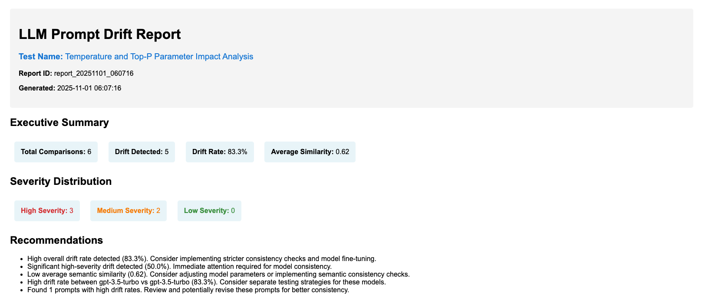
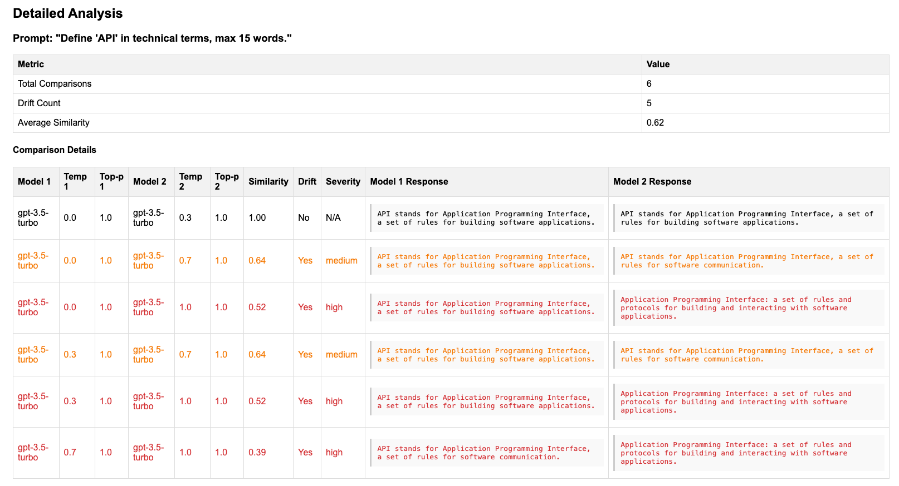

# LLM Prompt Regression Testing Framework

[](https://github.com/jingbinw/llm-prompt-regression/releases/latest)
[](https://www.python.org/downloads/)
[](https://opensource.org/licenses/MIT)

📦 **[Download Latest Release](https://github.com/jingbinw/llm-prompt-regression/releases/latest)** | 📋 **[View All Releases](https://github.com/jingbinw/llm-prompt-regression/releases)**

A comprehensive framework for testing LLM output consistency across different model versions and parameter configurations. This framework helps detect drift and inconsistencies in LLM responses, ensuring reliable AI applications.

## Features

- **Model Comparison**: Compare responses between different LLM models (GPT-3.5-turbo, GPT-4, etc.)
- **Parameter Variation Testing**: Test how different parameters (temperature, top_p, max_tokens) affect output consistency
- **Drift Detection**: Automated detection of response drift and inconsistencies
- **Comprehensive Reporting**: Generate detailed HTML, CSV, and JSON reports with visualizations
- **CI/CD Integration**: GitHub Actions workflow for automated regression testing
- **Docker Support**: Containerized testing environment
- **Flexible Configuration**: YAML/JSON configuration files for easy test customization

## Quick Start

### Prerequisites

- Python 3.11+
- OpenAI API key

### Installation

#### Option 1: Download Latest Release (Recommended)
1. **Download the latest stable release**
   - Go to [Releases](https://github.com/jingbinw/llm-prompt-regression/releases/latest)
   - Download the source code (zip or tar.gz)
   - Extract and follow steps 2-5 below

#### Option 2: Clone Repository (Development)
1. **Clone the repository**
   ```bash
   git clone https://github.com/jingbinw/llm-prompt-regression.git
   cd llm-prompt-regression
   ```

2. **Create and activate virtual environment** (for both options)
   ```bash
   # create virtural environment
   python -m venv venv

   # activate it on Mac/Linux:
   source venv/bin/activate

   # activate it on Windows: 
   venv\Scripts\activate
   ```

3. **Install dependencies**
   ```bash
   pip install -r requirements.txt
   ```

4. **Set up environment variables**
   ```bash
   cp env.example .env
   # Edit .env and add your OpenAI API key: OPENAI_API_KEY=your-api-key-here
   # env.example contains safe defaults, .env should contain your secrets
   ```

5. **Run a basic test**
   ```bash
   python examples/run_basic_test.py
   ```

   This will run a minimal test (4 API calls, ~160 tokens) to verify your setup.

6. **Run parameter variation test (optional)**
   ```bash
   python examples/run_parameter_variation_test.py
   ```

   This tests different parameter combinations (4 API calls, ~160 tokens).

## Usage

### Example Scripts

The framework includes optimized example scripts with minimal token usage:

#### Basic Test Example
```bash
python examples/run_basic_test.py
```

**Configuration:**
- 1 technical prompt: "Explain 'regression testing' in one sentence."
- 2 models: gpt-3.5-turbo and gpt-4
- 2 parameter variations: temperature 0.3/0.7
- **Total: 4 API calls, ~160 tokens**

#### Parameter Variation Test Example
```bash
python examples/run_parameter_variation_test.py
```

**Configuration:**
- 1 technical prompt: "Define 'API' in technical terms, max 15 words."
- 1 model: gpt-3.5-turbo
- 4 parameter variations: testing temperature and top_p
- **Total: 4 API calls, ~160 tokens**

Both examples are optimized for low token usage while demonstrating core functionality.

### Command Line Interface

The framework provides a comprehensive CLI for running tests:

```bash
# Run default test configuration
python -m src.cli run

# Run specific configuration file
python -m src.cli run --config my_test.yaml

# Run with custom parameters
python -m src.cli run \
  --model1 gpt-3.5-turbo \
  --model2 gpt-4 \
  --prompts "Explain AI" "What is machine learning?" \
  --temperature1 0.0 \
  --temperature2 1.0

# Run test suite
python -m src.cli run-suite \
  --config my_test_suite.yaml

# Generate reports from existing results
python -m src.cli report --input reports/results.json

# Create configuration files
python -m src.cli config --create-default
```

### Configuration Files

Create YAML or JSON configuration files to define your tests:

```yaml
# my_test.yaml
test_name: "My Custom Test"
prompts:
  - "Explain quantum computing in simple terms."
  - "Write a haiku about artificial intelligence."

models:
  - name: "gpt-3.5-turbo"
    model_type: "gpt-3.5-turbo"
    parameters:
      temperature: 0.7
      max_tokens: 200
  
  - name: "gpt-4"
    model_type: "gpt-4"
    parameters:
      temperature: 0.7
      max_tokens: 200

parameter_variations:
  - temperature: 0.0
    description: "Deterministic"
  - temperature: 1.0
    description: "Creative"

max_retries: 3
request_timeout: 30
batch_size: 5
output_dir: "./reports"
```

## Docker Usage (Optional)

A minimal Docker setup is available for containerized testing:

```bash
# Build the Docker image
docker build -t llm-prompt-regression .

# Run tests in Docker
docker run --rm \
  -e OPENAI_API_KEY="your-api-key" \
  -v $(pwd)/reports:/app/reports \
  llm-prompt-regression

# Using Docker Compose
docker-compose up
```

## Reports and Metrics

The framework generates comprehensive reports including:

### Drift Metrics
- **Exact Match**: Whether responses are identical
- **Semantic Similarity**: TF-IDF based similarity score (or optional OpenAI embeddings)
- **Token Count Difference**: Length variation between responses
- **Response Time Difference**: Performance comparison

### Report Formats
- **HTML Report**: Interactive dashboard with visualizations
- **CSV Report**: Detailed data for analysis
- **JSON Report**: Machine-readable results
- **Charts**: Visual representations of drift patterns

### HTML Report Examples

The framework generates comprehensive HTML reports with detailed drift analysis and interactive visualizations:





### Example Report Structure
```
reports/
├── report_20240101_120000.json      # Detailed results
├── report_20240101_120000.html      # HTML dashboard
├── detailed_results_20240101_120000.csv  # CSV data
├── report_20240101_120000_drift_distribution.png
├── report_20240101_120000_similarity_heatmap.png
├── report_20240101_120000_token_comparison.png
└── report_20240101_120000_response_time.png
```

## CI/CD Integration

### GitHub Actions

The framework includes a streamlined CI/CD pipeline with automated LLM testing:

```yaml
# .github/workflows/ci.yml
name: CI Pipeline
on:
  push:
    branches: [main]
  pull_request:
    branches: [main]
```

**Pipeline Features:**
- **Test Job**: Runs unit and integration tests with mocked API calls (no token cost)
- **LLM Regression Test Job** (on push to main only):
  - Runs `run_basic_test.py` (4 API calls, ~160 tokens)
  - Runs `run_parameter_variation_test.py` (4 API calls, ~160 tokens)
  - **Total per CI run: 8 API calls, ~320 tokens**
  - Uploads HTML/CSV reports and charts as artifacts
  - Can be skipped with "skip-llm" in commit message
- **Docker Test Job** (optional): Builds and tests in Docker container

### Setting up GitHub Actions

1. **Add secrets to your repository:**
   - Go to Settings → Secrets and variables → Actions
   - Add `OPENAI_API_KEY` with your OpenAI API key

2. **Monitor results:**
   - Check GitHub Actions tab for test results
   - Download report artifacts from completed runs
   - Review drift analysis and parameter effects
## LangChain usage

- Real LLM runs: By default they do NOT use LangChain. They use TF‑IDF cosine similarity unless you explicitly enable embeddings (via `USE_EMBEDDINGS=true` or `MetricsCalculator(use_embeddings=True)`).
- Unit/integration tests: They never use LangChain; they run fully locally with TF‑IDF and mocked API calls (zero token cost).

To enable embeddings in real runs (incurs token cost):
- macOS zsh: `export USE_EMBEDDINGS=true`
- Or construct explicitly in code: `MetricsCalculator(use_embeddings=True)`

## Testing

### Run Tests Locally

```bash
# Activate your virtual environment (if not already activated)
source venv/bin/activate  # On Windows: venv\Scripts\activate

# Run all tests (mocked, no API calls)
pytest tests/ -v

# Run with coverage
pytest tests/ --cov=src --cov-report=html --cov-report=term

# Run specific test categories
pytest tests/unit/ -v        # Unit tests only
pytest tests/integration/ -v # Integration tests only
```

### Test Categories

- **Unit Tests**: Test individual components (metrics, config loader, validators)
  - All API calls are mocked
  - No OpenAI API key required
  - Fast execution (~5 seconds)

- **Integration Tests**: Test component interactions and end-to-end workflows
  - All API calls are mocked
  - No OpenAI API key required
  - Medium execution (~10 seconds)

**Total: 20 tests, all passing, zero token cost**

### Example Tests (Real API Calls)

```bash
# API key should already be set in .env file from Installation step 4
# If not, edit .env and add: OPENAI_API_KEY=your-api-key-here

# Run basic test example (4 calls, ~160 tokens)
python examples/run_basic_test.py

# Run parameter variation test (4 calls, ~160 tokens)
python examples/run_parameter_variation_test.py

# Verify API key is working (1 call, ~10 tokens)
python examples/test_openai_key.py
``` 

## License

This project is licensed under the MIT License - see the [LICENSE](LICENSE) file for details.